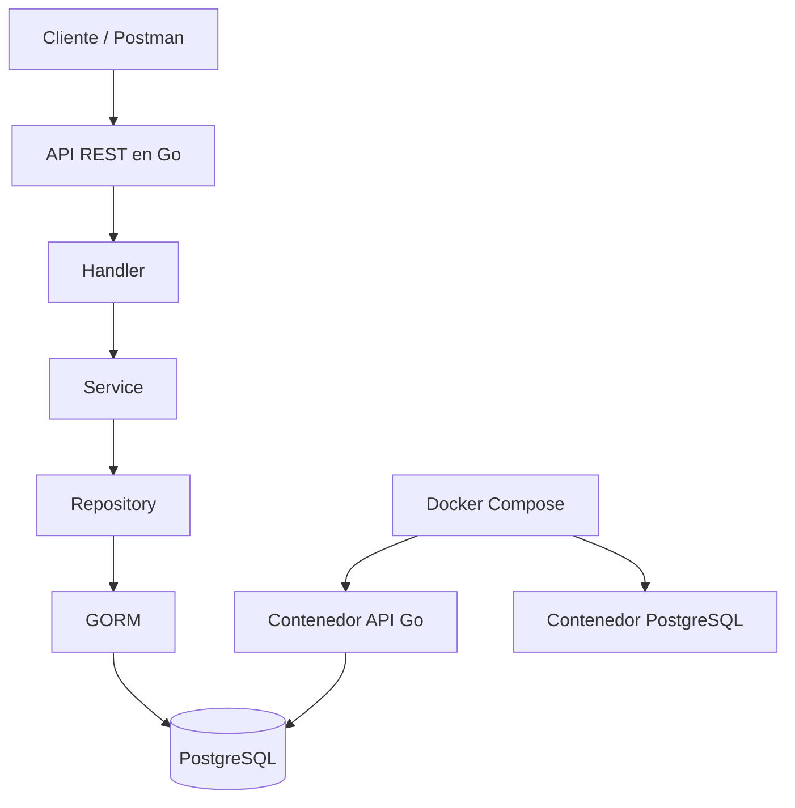

# Diagrama de Arquitectura

## Explicación

El proyecto utiliza una arquitectura en capas:

- **Handler:** recibe las peticiones HTTP.
- **Service:** contiene la lógica del negocio.
- **Repository:** se comunica con la base de datos.
- **GORM:** ORM utilizado para trabajar con PostgreSQL.
- **PostgreSQL:** base de datos persistente del sistema.
- **Docker Compose:** levanta la API y la base de datos en contenedores.